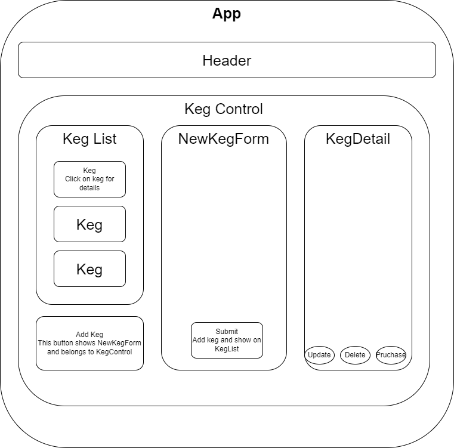

# Kegs"R"Us

### A React application built to track inventory of kegs.
#### By _**Rian Carter**_

## Technologies Used
* _React_
* _Javascript_
* _HTML_
* _Markdown_

## Description
* This application was developed to utilize full CRUD functionality. A user can view, add, update, and delete kegs, as well as "purchase" kegs. When a user purchases a keg, the quantity will be reduced by one keg.



## Setup/Installation
* _Go to [https://github.com/Rian-Carter/pintsAndPitchers.git]_
* _Clone this repository to your local machine by running the following command_
```$ git clone https://github.com/Rian-Carter/pintsAndPitchers.git```
* _Navigate to root folder and open directory in your terminal_

#### Build Enviroment
* _Install Packages:_```$ npm install```

#### Server:
* _Start Server:_```$ npm run start```

##### The application should automatically launch in your browser and if not
* _Open your browser and navigate to:_```http://localhost:3000/```

## Known Bugs
* _There are no known bugs at this time_
* _Please send any bugs to r.c#&$^86@h*.com_

## License
[MIT](https://choosealicense.com/licenses/mit/)

Copyright (c) _2002_, _Rian Carter_
